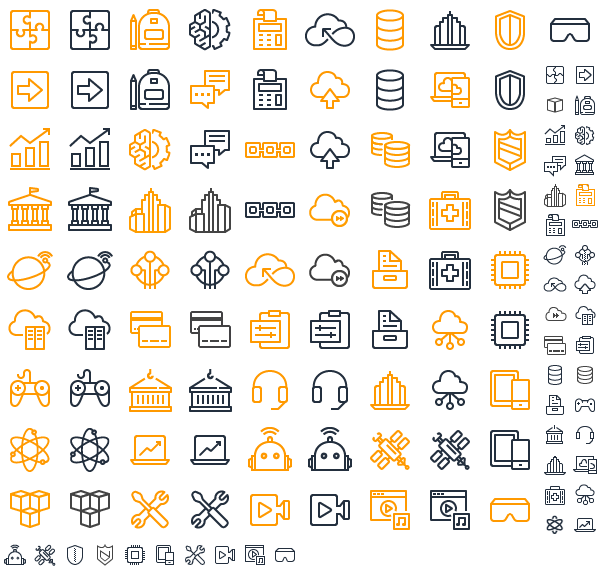

# aws-diagrams-resources

* [aws-diagrams-resources.pptx](aws-diagrams-resources.pptx)
* [AWS-Architecture-Icons-Deck_For-Light-BG_20200430.pptx](AWS-Architecture-Icons-Deck_For-Light-BG_20200430.pptx)
* reference reinvent, etc. decks on [AWS Events Content](https://aws.amazon.com/events/events-content/) for examples/ideas.
* [`products_services_sprite_sheet.png`](products_services_sprite_sheet.png)
    
* various icon and images on <https://aws.amazon.com/> for service categories, industries, etc.
    

    

    

    